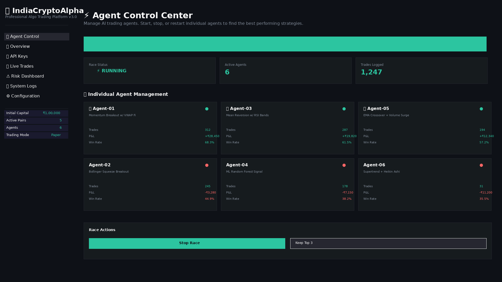
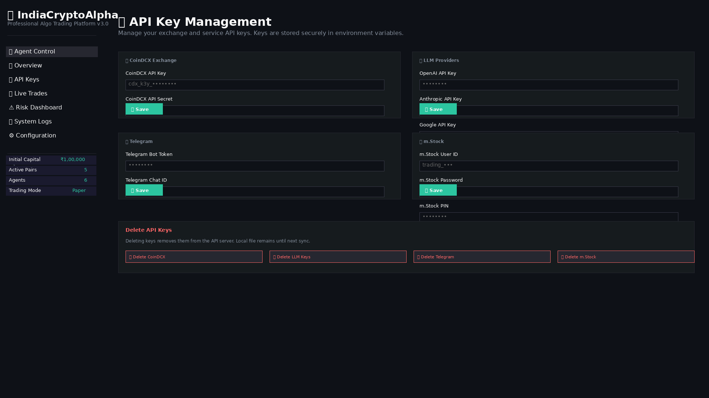
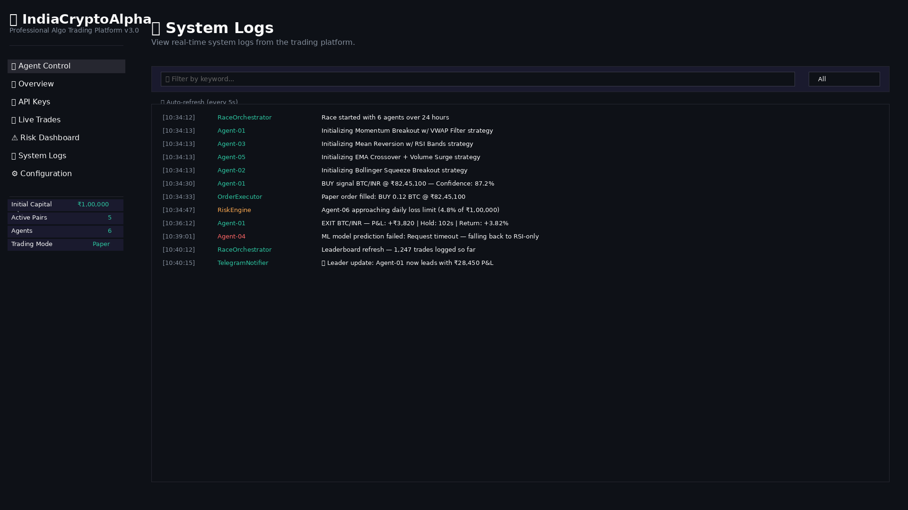

# IndiaAI Race Alpha - Autonomous AI Trading System

**Transforming IndiaCryptoAlpha into a cutting-edge AI Race Trading System.**

This repository now hosts **IndiaAI Race Alpha**, a sophisticated platform where autonomous, LLM-powered AI trading agents compete head-to-head in real-time "lane races" to maximize their virtual capital. Inspired by the concept demonstrated in the YouTube video "I forced the top AI trading bots to compete to make money", this system is designed for Indian markets, supporting both crypto (CoinDCX) and stocks (m.Stock Trading API).

## 🎯 Core Vision (Matching the Video Exactly)

-   **12–36 Autonomous AI Trading Agents**: Agents compete in a real-time "lane race."
-   **Equal Virtual Capital**: Each agent starts with ₹1,00,000 INR (configurable).
-   **Configurable Race Duration**: Default 24–48 hours, or continuous live mode.
-   **Independent Research & Trading**: Agents research markets, backtest, develop/evolve strategies, and execute trades.
-   **Real-time Dashboard**: Beautiful "race" visualization with lane bars, equity curve lines, live P&L, leaderboard, total trades, win rate, etc.
-   **High Profitability**: 75%+ agents should finish profitable in most races.
-   **Winner Gets Bragging Rights**: Option to trade a real portfolio for the next period.
-   **Dual Market Support**: Fully supports crypto (CoinDCX) and stocks (m.Stock Trading API).

## ✨ Key Features

### Autonomous LLM-Powered AI Agents

Each agent is now an LLM-driven autonomous entity (configurable via `.env` for Grok/xAI, OpenAI, or Claude) comprising:

-   **Researcher Sub-agent**: Pulls live + historical data, analyzes market regimes, and backtests ideas.
-   **Strategist Sub-agent**: Uses LLM to invent, evolve, or combine strategies (technical indicators, mean-reversion, breakout, pivot points, machine-learning signals, or creative ideas).
-   **Executor Sub-agent**: Places paper (or live) trades via CoinDCX (CCXT) and m.Stock Trading API (using the official Python SDK `mStock-TradingApi-A`).

Agents can trade crypto only, stocks only, or both (configurable per race or per agent). They are designed to "evolve," with the LLM reviewing performance and tweaking parameters, switching strategies, or generating new Python strategy code snippets dynamically.

### New Race Orchestrator (`race/orchestrator.py`)

-   Spawns `N` AI agents (configurable in `.env`).
-   Each agent runs in its own isolated "lane" with its own virtual portfolio.
-   Manages race timer, start/stop, pause, and reset functionalities.
-   Takes periodic snapshots of all agents’ equity for the race dashboard.

### Enhanced Streamlit Dashboard (`dashboard/race_app.py`)

Designed to look and feel exactly like the video’s "lane race" dashboard:

-   **Top Bar**: Race timer, total agents, total trades made.
-   **Main View**: Horizontal or vertical "lanes" with agent name + colored progress bar showing current profit %.
-   **Live Equity Curve Chart**: Multi-line chart for all agents.
-   **Leaderboard Table**: Rank, agent name, P&L, win rate, trades, strategy summary.
-   **Agent Detail Panels**: Click an agent to see its current strategy, last trades, and research notes.
-   **Real-time Updates**: Every 5–10 seconds.
-   **Visuals**: Dark mode, beautiful charts (Plotly or Streamlit native).
-   **Export**: Race results to Excel/PDF.

### Market Data & Execution

-   **CoinDCX**: Existing CCXT integration maintained.
-   **m.Stock**: Full integration using the official Python SDK, supporting order placement, portfolio, and real-time market data via REST + WebSocket.
-   **Paper-trading Mode First**: Default for safety; an `.env` flag enables live trading on either/both brokers.
-   **Risk Engine**: Applied per agent (position sizing, daily loss limit, stop-loss, etc.).

### Additional Features

-   **Telegram Alerts**: Race start, leader changes, big wins/losses, final results.
-   **Full Logging**: Per agent + master race log.
-   **Configurable**: Via `.env` (number of agents, race duration, starting capital, LLM provider + API key, brokers to enable, markets, etc.).
-   **Safety**: All trades are paper by default; clear warnings before enabling live trading.
-   **Evolutionary Pressure**: After every race, top 3 agents can "breed" strategies into the next race (optional advanced mode).

## 📋 Requirements

### Python Version Compatibility

- **Python 3.11 - 3.12**: Fully supported with all pinned dependency versions.
- **Python 3.13**: Supported with updated `numpy>=2.1.0` and `pandas>=2.2.3` (pre-built wheels available). The setup script auto-detects your Python version and installs compatible packages.

### Laptop (WSL Kali/Ubuntu)

-   Python 3.11+
-   4GB RAM minimum (8GB+ recommended for multiple LLM agents)
-   Internet connection
-   CoinDCX API keys (optional, for live crypto trading)
-   m.Stock API credentials (optional, for live stock trading)
-   Telegram bot token (optional, for alerts)
-   LLM API key (OpenAI, Anthropic, Google, or xAI)

### Termux (Android)

-   Termux app installed
-   Python 3.11+
-   1GB free storage
-   Same API credentials as above

## 🚀 Installation

1.  **Clone the repository**

    ```bash
    git clone https://github.com/googial/IndiaCryptoAlpha
    cd IndiaCryptoAlpha
    ```

2.  **Run setup script**

    ```bash
    chmod +x setup.sh
    ./setup.sh
    ```

3.  **Activate virtual environment**

    ```bash
    source venv/bin/activate
    ```

4.  **Verify installation**

    ```bash
    python -c "import ccxt, pandas, streamlit; print(\'✓ All core dependencies installed\')"
    ```

## ⚙️ Configuration

Create a `.env` file in the project root and populate it with your API keys and desired race parameters. Refer to `QUICKSTART_RACE.md` for a detailed example.

```env
# LLM Configuration (Choose one and provide API key)
LLM_PROVIDER=openai      # Options: openai, anthropic, google, xai
OPENAI_API_KEY=sk-your_openai_api_key
ANTHROPIC_API_KEY=
GOOGLE_API_KEY=
XAI_API_KEY=

# m.Stock Configuration (if enabling live stock trading)
MSTOCK_USER_ID=
MSTOCK_PASSWORD=
MSTOCK_PIN=
MSTOCK_API_KEY=
MSTOCK_API_SECRET=

# CoinDCX API Configuration (for crypto trading)
COINDCX_API_KEY=your_coindcx_api_key
COINDCX_API_SECRET=your_coindcx_api_secret

# Telegram
TELEGRAM_BOT_TOKEN=your_bot_token
TELEGRAM_CHAT_ID=your_chat_id

# Race Configuration
RACE_DURATION_HOURS=24
NUM_RACE_AGENTS=12
RACE_UPDATE_INTERVAL_SEC=10
EVOLUTION_INTERVAL_MIN=60

# Other Trading Settings
INITIAL_PORTFOLIO=100000
PAPER_TRADING_MODE=true
RISK_PER_TRADE=0.02
MAX_PORTFOLIO_EXPOSURE=0.10
STOP_LOSS_PERCENT=0.03
DAILY_MAX_LOSS_PERCENT=0.05
```

## 🎮 Usage

### Start the AI Race System

The trading system and API server now start together with a **single command**:

```bash
# In project directory, with venv activated
python main.py
```

When `main.py` runs, it automatically:
1. Starts the **Flask API Control Server** (port 5000, background thread)
2. Spawns and manages all AI trading agents
3. Streams logs to `logs/trading_system.log`

Press `Ctrl+C` to stop.

### Access the Professional Dashboard

Launch the dashboard in a separate terminal:

```bash
streamlit run dashboard/app.py
```

Open **http://localhost:8501** in your browser.

#### Dashboard Features

| Section | What You Can Do |
|---------|----------------|
| **📊 Overview** | Portfolio P&L, win rate, Sharpe/Sortino ratios, trade distribution, cumulative P&L chart |
| **⚡ Agent Control** | Start/stop the race, view agent cards, restart individual agents, stop underperformers |
| **📈 Live Trades** | Monitor open positions, closed trades, unrealized P&L |
| **🔑 API Keys** | Enter and manage CoinDCX, m.Stock, OpenAI, Anthropic, Google, Telegram keys directly from UI |
| **⚠️ Risk Dashboard** | Real-time risk alerts (drawdown, win rate, profit factor), risk/reward ratio |
| **📋 System Logs** | Live log viewer with search, log level filter, auto-refresh every 5s |
| **⚙️ Configuration** | Edit all `.env` parameters (portfolio, risk, agent count, intervals) via the UI |

### 📸 Screenshots

**Agent Control Center** — Monitor all agents' live P&L, trades, win rates, and Sharpe ratios. Restart underperformers or auto-keep top agents.



**API Key Management** — Securely enter exchange and LLM keys directly from the dashboard.



**System Logs** — Real-time log viewer with keyword search and log-level filtering.



### 📸 Screenshots

**Agent Control Center** — Monitor all agents' live P&L, trades, win rates, and Sharpe ratios. Restart underperformers or auto-keep top agents.


**API Key Management** — Securely enter exchange and LLM keys directly from the dashboard.


**System Logs** — Real-time log viewer with keyword search and log-level filtering.


## 🔮 Professional Dashboard

The dashboard (`dashboard/app.py`) is a **professional-grade algo trading platform** with full system control — manage agents, API keys, configuration, and logs all from one UI.

### Backend API Server

A Flask-based REST API (`api_server.py`) runs automatically as a background thread when you start `main.py`, enabling full remote control:

- `GET /api/health` — check server health
- `POST /api/race/start`, `POST /api/race/stop` — global race control
- `GET /api/race/status`, `GET /api/race/leaderboard` — real-time data
- `POST /api/agents/<id>/stop`, `POST /api/agents/<id>/restart` — per-agent control
- `GET/POST /api/config` — configuration fetch and update
- `GET/POST /api/apikeys/<name>` — secure key management
- `GET /api/logs` — fetch recent log entries
- `GET /api/trades`, `GET /api/analytics/performance` — data export

To enable the API server (currently allows local control), set `ALLOW_API_CONTROL=true` in your `.env` file. The dashboard uses this API for all controls.
IndiaCryptoAlpha/
├── config/                 # Configuration module
│   └── __init__.py        # Environment variables
├── core/                   # Core trading system
│   ├── market_data.py     # CoinDCX API integration
│   ├── risk_engine.py     # Risk management
│   ├── order_execution.py # Order simulation & m.Stock integration
│   ├── mstock_client.py   # m.Stock API client
│   └── __init__.py
├── agents/                 # Strategy agents
│   ├── base_agent.py      # Base class
│   ├── llm_agent.py       # LLM-powered autonomous agent
│   ├── rsi_macd_agent.py  # (Legacy) RSI+MACD strategy
│   ├── bollinger_volume_agent.py  # (Legacy) Bollinger Band strategy
│   ├── ema_supertrend_agent.py    # (Legacy) EMA Crossover strategy
│   └── __init__.py
├── logger/                 # Logging and accounting
│   ├── database.py        # SQLite logging
│   ├── excel_logger.py    # Excel export
│   ├── accountant_agent.py # Financial calculations
│   └── __init__.py
├── monitor/                # Monitoring and alerts
│   ├── telegram_monitor.py # Telegram integration
│   ├── monitor_agent.py   # System monitoring
│   └── __init__.py
├── race/                   # Race Orchestration
│   ├── orchestrator.py    # Main race logic
│   └── __init__.py
├── researcher/             # Research and backtesting
│   ├── backtest_engine.py # Backtesting
│   ├── researcher_agent.py # Market analysis
│   └── __init__.py
├── dashboard/              # Streamlit dashboards
│   ├── app.py            # (Legacy) Overview dashboard
│   ├── race_app.py       # New Race Visualization Dashboard
│   └── __init__.py
├── data/                   # Data storage
├── logs/                   # Log files
├── main.py                 # Main system entry point (now runs race)
├── generate_demo_race.py   # Script to run a short demo race
├── requirements.txt        # Python dependencies
├── setup.sh               # Setup script
├── .env                   # Configuration (create this)
├── README.md              # This file
└── QUICKSTART_RACE.md     # Quickstart guide for race mode
```

## 🔄 System Architecture

```
+-----------------------+
|  Race Orchestrator    |
| (race/orchestrator.py)|
+-----------+-----------+
            |
            v
+-----------------------+
|  LLM Trading Agents   |
| (agents/llm_agent.py) |
+-----------+-----------+
    ^   ^   |
    |   |   v
    |   |  +-----------------------+
    |   +--|  Researcher Sub-agent |
    |      +-----------------------+
    |                  |
    |                  v
    |      +-----------------------+
    +------|  Strategist Sub-agent |
           +-----------------------+
                           |
                           v
               +-----------------------+
               |  Executor Sub-agent   |
               | (CoinDCX, m.Stock)    |
               +-----------+-----------+
                           |
                           v
               +-----------------------+
               |  Risk Engine          |
               |  Order Executor       |
               |  Market Data Manager  |
               +-----------+-----------+
                           |
                           v
               +-----------------------+
               |  Accountant Agent     |
               |  Monitor Agent        |
               +-----------+-----------+
                           |
                           v
               +-----------------------+
               |  SQLite, Excel,       |
               |  Telegram Alerts      |
               +-----------------------+

+-----------------------------------+
|  Streamlit Race Dashboard         |
| (dashboard/race_app.py)           |
|  (Real-time visualization)        |
+-----------------------------------+
```

## 🔧 Troubleshooting

### Issue: "ModuleNotFoundError: No module named 'mstock_trading_api'"
-   Ensure you have installed the `mStock-TradingApi-A` package. If not, run `pip install mStock-TradingApi-A` after activating your virtual environment.
-   Verify that `mStock-TradingApi-A` is compatible with your Python version and system.

### Issue: LLM API Key not working
-   Check your `.env` file for the correct `LLM_PROVIDER` and corresponding API key (e.g., `OPENAI_API_KEY`).
-   Ensure your API key has the necessary permissions and is not expired.
-   Verify internet connectivity to the LLM provider's API endpoint.

### General Issues
-   Check logs: `tail -f logs/trading_system.log` or `tail -f logs/demo_race.log`
-   Review configuration: Check your `.env` file for any typos or missing values.
-   Ensure your Python virtual environment is activated: `source venv/bin/activate`

## 📄 License

This project is provided as-is for educational and personal use.

## 🤝 Support

For issues or questions, please refer to the troubleshooting section or open an issue on GitHub.

---

**Built with ❤️ for Indian traders**

**Status**: AI Race Alpha (Paper Trading Mode by default)

**Last Updated**: 2026-04-02

## 🐛 Python 3.13 Compatibility

If you're using **Python 3.13**, `setup.sh` automatically installs compatible versions:
- `numpy>=2.1.0`
- `pandas>=2.2.3`

Older versions (`numpy==1.26.4`, `pandas==2.1.4`) fail on Python 3.13 due to Python C API changes (`_PyLong_AsByteArray`). The updated requirements have pre-built Python 3.13 wheels, so no local compilation is needed.

If you encounter build errors, ensure you're on the latest commit: `git pull origin main`.
